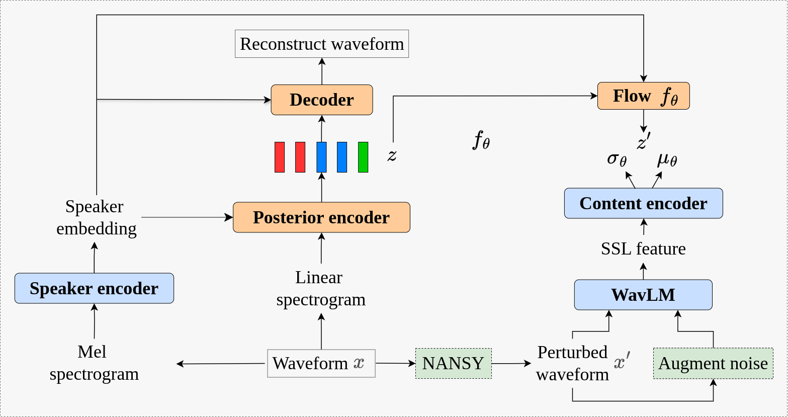
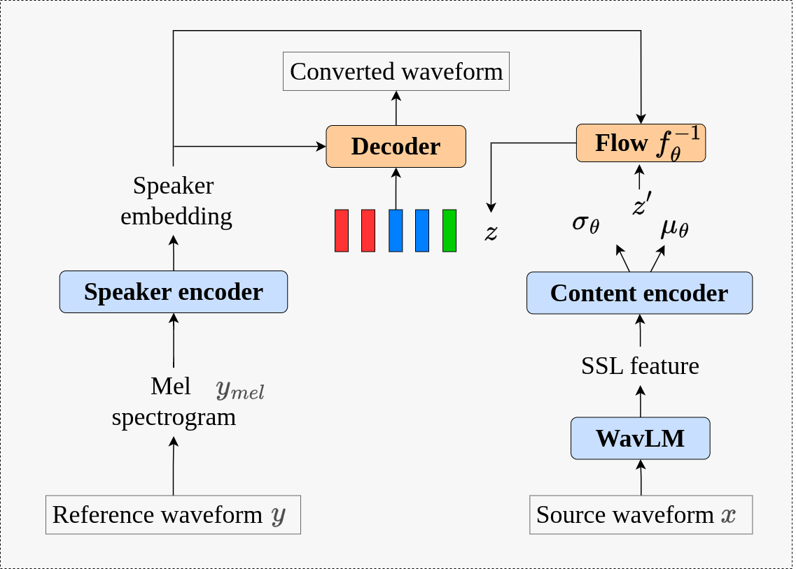

# RE-VC: Robust zero-shot voice conversion model for realistic environments

### Luong Ho, Hao Do, Minh Nguyen and Duc Chau

We propose RE-VC: Robust zero-shot voice conversion model for realistic environments.

Voice conversion (VC) technology, which enables the transformation of one speaker’s voice to that of another while preserving linguistic content, has seen significant advancements in recent years. However, existing VC models face two major challenges: reduced voice quality when processing noisy speech and diminished voice similarity in zero-shot inference scenarios. In this paper, we propose a novel approach to address these issues by integrating a content encoder with WavLM model to effectively extract linguistic features and an attention-based speaker encoder to capture speaker-specific characteristics. This design enhances both the quality and similarity of the converted speech. Additionally, we introduce a noise augmentation strategy aimed at improving the model’s robustness during training, enabling it to better handle noisy speech in realistic environments. Extensive experiments, including both objective and subjective evaluations, demonstrate that our model surpasses existing methods, offering improved performance and robustness.

We also provide the [pretrained models](https://drive.google.com/drive/folders/1s3yOrQKK2GxMz1FkUKRTdlSNBBkJ7N7g?usp=sharing).

<table style="width:100%">
  <tr>
    <th>RE-VC at training</th>
    <th>RE-VC at inference</th>
  </tr>
  <tr>
    <td></td>
    <td></td>
  </tr>
</table>


## Pre-requisites
0. Python >= 3.6
0. Clone this repository
0. Install python requirements. Please refer [requirements.txt](requirements.txt)

## Noise augmentation (Optional)
Enhance the dataset by augmenting noise using [this repository](https://github.com/Sato-Kunihiko/audio-SNR). However, noise-augmented audio is only utilized as input for the WavLM model.

## Training and Inference Exmaple
```sh
## Training Example
python train.py -c configs/configs.json -m vctk_base


## Inference Example
python inference.py
